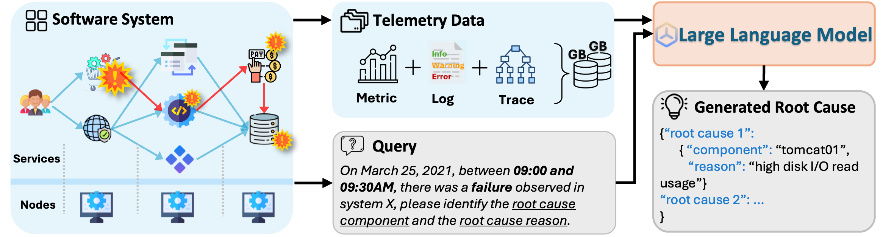
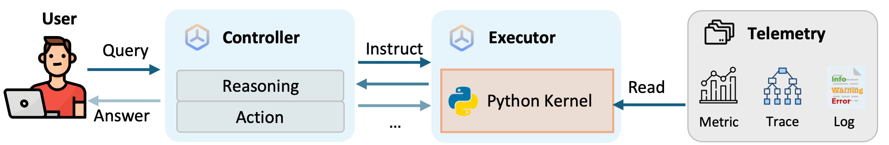

# OpenRCA

&ensp;
[](https://opensource.org/licenses/MIT)&ensp;


</div>

OpenRCA is a public benchmark for assessing LLMs' root cause analysis ability in a practical software operating scenario. It consists of 335 failure cases collected from three heterogeneous software systems deployed in the real world, accompanied by over 68 GB of de-identified telemetry data. Each failure case is paired with a query in natural language, requiring LLMs to analyze massive telemetry data to generate the corresponding root causes elements, including time, component, and reason. The process demands LLMs understand intricate system dependencies and conduct complex reasoning across telemetry data of diverse types, such as time series, dependency graphs, and semi-structured text.

 

</div>

To outline a possible direction for solving OpenRCA tasks, we further developed RCA-agent, a multi-agent system based on program synthesis and execution. By utilizing Python for data retrieval and analysis, the model is freed from processing large telemetry as an overly long context. This allows the model to focus solely on reasoning and make it scalable for massive telemetry. With RCA-agent, the accuracy of Claude 3.5 is further improved to 11.34%.

 

## 🆕 News

- 📅2024-11-04: OpenRCA is released on GitHub🎈. 

## ✨ Quick Start

### 🛠️ Step 1: Installation

OpenRCA requires **Python >= 3.10**. It can be installed by running the following command:
```bash
# [optional to create conda environment]
# conda create -n openrca python=3.10
# conda activate openrca

# clone the repository
git clone https://github.com/microsoft/OpenRCA.git
cd OpenRCA
# install the requirements
pip install -r requirements.txt
```

The telemetry data can be download from the [Google Drive](https://drive.google.com/drive/folders/1wGiEnu4OkWrjPxfx5ZTROnU37-5UDoPM?usp=drive_link). Once you have download the telemetry dataset, please put them into the path `data/` (which is empty now).

The directory structure of the data is:

```
.
├── {SYSTEM}
│   ├── query.csv
│   ├── record.csv
│   └── telemetry
│       ├── {DATE}
│       │   ├── log
│       │   ├── metric
│       │   └── trace
│       └── ... 
└── ...
```

where the `{SYSTEM}` can be `Telecom`, `Bank`, or `Market`, and the `{DATE}` format is `{YYYY_MM_DD}`.

### 🖊️ Step 2: Configure the LLMs

Before running RCA-Agent and other baselines on OpenRCA, you need to provide your API configurations. Taking OpenAI as an example, you can configure `api_config.yaml` file as follows. 

```yaml
SOURCE:   "OpenAI"
MODEL:    "gpt-4o-2024-05-13"
API_KEY:  "sk-xxxxxxxxxxxxxx"
```

### 🚩 Step 3: Start Evaluation

```bash
python scripts/{SCRIPTS} --dataset {DATASET_NAME}
# Optional scripts: run_agent.py, run_baseline_balanced.py, run_baseline_oracle.py
# Optional datasets: Telecom, Bank, Market/cloudbed-1, Market/cloudbed-2
```

For example, if f you want to evaluate RCA-Agent on Bank dataset, you should use the following command:

```bash
python scripts/run_agent.py --dataset Bank
```

Note that the telemetry of two Market cloudbed service group are collected separately. For example, if you want to evaluate RCA-Agent on the whole Market dataset, you should use the following command:

```bash
python scripts/run_agent.py --dataset Market/cloudbed-1
python scripts/run_agent.py --dataset Market/cloudbed-2
```

## 📚 Citation

If you use OpenRCA in your research, please cite our paper:

```
@inproceedings{
xu2025openrca,
title={OpenRCA: Can Large Language Models Locate the Root Cause of Software Failures?},
author={Xu, Junjielong and Zhang, Qinan and Zhong, Zhiqing and He, Shilin and Zhang, Chaoyun and Lin, Qingwei and Pei, Dan and He, Pinjia and Zhang, Dongmei and Zhang, Qi},
booktitle={The Thirteenth International Conference on Learning Representations},
year={2025},
url={https://openreview.net/forum?id=M4qNIzQYpd}
}
```

## Trademarks

This project may contain trademarks or logos for projects, products, or services. Authorized use of Microsoft 
trademarks or logos is subject to and must follow 
[Microsoft's Trademark & Brand Guidelines](https://www.microsoft.com/en-us/legal/intellectualproperty/trademarks/usage/general).
Use of Microsoft trademarks or logos in modified versions of this project must not cause confusion or imply Microsoft sponsorship.
Any use of third-party trademarks or logos are subject to those third-party's policies.

## Disclaimer
The recommended models in this Repo are just examples, used to explore the potential of agent systems with the paper at [TODO]. Users can replace the models in this Repo according to their needs. When using the recommended models in this Repo, you need to comply with the licenses of these models respectively. Microsoft shall not be held liable for any infringement of third-party rights resulting from your usage of this repo. Users agree to defend, indemnify and hold Microsoft harmless from and against all damages, costs, and attorneys' fees in connection with any claims arising from this Repo. If anyone believes that this Repo infringes on your rights, please notify the project owner email.
